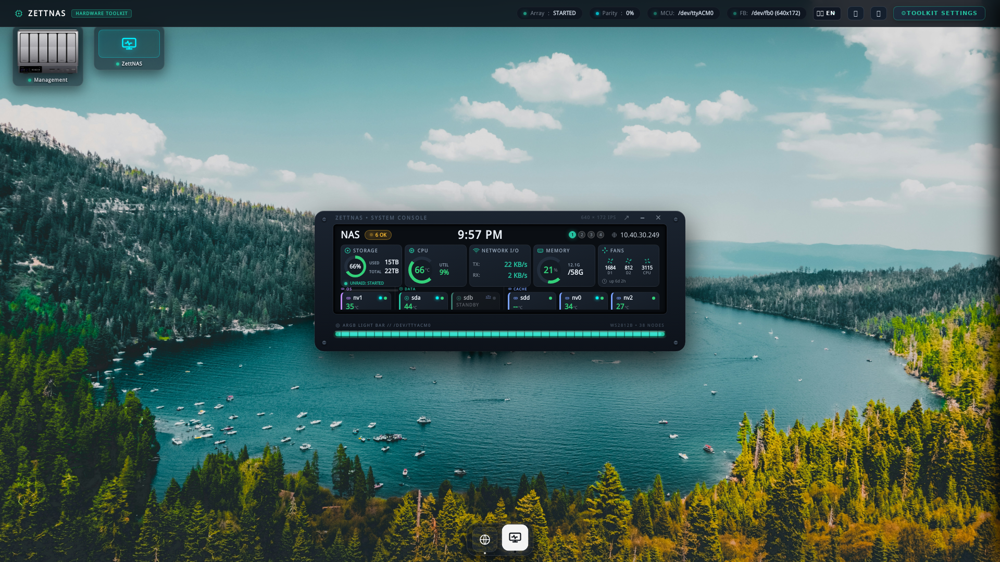

<div align="center">
  
  <h1>ZettNAS Toolkit</h1>
  <p><strong>All-in-one chassis management suite and live front-panel LCD dashboard for Zettlab NAS enclosures (D4, D6, D8).</strong></p>

  <p>
    <a href="https://github.com/fr0styx/zettnas-toolkit/releases"></a>
    <a href="LICENSE"></a>
    
    
  </p>
</div>

---

## Overview

**ZettNAS Toolkit** is a comprehensive hardware management suite engineered specifically for Zettlab NAS chassis (D4, D6, and D8 models) running Unraid or Debian/Docker environments.

It delivers **zero-overhead, direct-to-framebuffer rendering** for the 640×172 front-panel IPS display, **intelligent dual-zone thermal fan curve regulation**, **dynamic ARGB LED lightbar effects** with error-reactive lighting, and a **real-time web studio** with drag-and-drop live canvas arrangement.

<div align="center">
  
</div>

---

## Key Features

* **🖥️ Direct Framebuffer LCD (`/dev/fb0`)** — Zero-overhead 640×172 native rendering via hardware-accelerated CSS orientation transforms and single-pass memory-mapped (`mmap`) streaming (704 stride). Dynamic backlight discovery, screen-off pause (0 FPS), and adaptive FPS (1 FPS idle → target FPS).
* **🎛️ Modern Web Studio & OS Desktop (Port `8082`)** — Windowed desktop OS experience with draggable, minimizable windows, interactive dock bar with hover previews, top-left chassis console launcher, S.M.A.R.T. health diagnostics modal, and live layout reordering.
* **❄️ Intelligent Per-Zone Fan Control** — Independent multi-point fan curves for HDD backplanes, NVMe cache, and CPU cooling with hysteresis hold protection and safety overrides.
* **🔔 Multi-Channel Notifications** — Native Unraid alerts (`notify`), ntfy.sh push messages, and Generic/Discord webhooks for fan stalls, CPU thermals, drive S.M.A.R.T. health, and media copy events.
* **📡 Zero-Latency SSE Broadcaster** — Centralized fan-out streaming daemon delivers instantaneous telemetry with 0ms reaction time and zero redundant polling.
* **💡 Chassis ARGB Lightbar (`/dev/ttyACM0`)** — Microcontroller integration for 38 WS2812B LEDs featuring Solid, Breathe, Flow, Rainbow, disk I/O Cylon animations, error-reactive alerts (red/amber), and schedule-aware night dimming.
* **💾 Hardware Media Ingestion** — One-touch front-panel SD/TF card ingestion directly to array storage with chunked async I/O (`aiofiles`), real-time pause/resume, duplicate pre-scanning, and clean abort handling.

---


## Hardware Compatibility

| Component | Target Hardware | Notes |
| :--- | :--- | :--- |
| **Enclosures** | Zettlab D4, D6, D8 | Auto-detected via DMI product name or discovered drive topology |
| **Display** | Internal 640×172 IPS LCD | Interfaced directly via `/dev/fb0` (stride 704) |
| **Fan Controller** | Motherboard `hwmon` | Supports `nct6775`, `it87`, `zettlab_d8_fans`, or standard Linux PWM (`pwm1`–`pwm3`) |
| **ARGB Strip** | Built-in USB microcontroller | Recognized as `ZettOS_RGB` or `/dev/ttyACM0` (38 WS2812B nodes) |

---

## Installation & Deployment

> [!IMPORTANT]  
> **Default Admin Password**: `admin`  
> *(You can change this anytime from the "Account & Security" section in the web dashboard's Toolkit Settings).*


### Option A: Unraid Docker Template (Recommended for Unraid)

1. On your Unraid server, place [`unraid/zettnas-toolkit.xml`](unraid/zettnas-toolkit.xml) into:
   ```bash
   /boot/config/plugins/dockerMan/templates-user/my-zettnas-toolkit.xml
   ```
2. Navigate to the **Docker** tab in the Unraid web interface.
3. Click **Add Container**, select **zettnas-toolkit** from the template dropdown, verify device paths (`/dev/fb0`, `/dev/dri`), and click **Apply**.
4. The container will automatically appear with the official icon, WebUI button, and full Unraid management features.

---

### Option B: Docker Compose

1. **Verify Prerequisites**:
   Ensure `/dev/fb0` and `/dev/ttyACM0` exist on your host:
   ```bash
   ls -l /dev/fb0 /dev/ttyACM0
   ```

2. **Clone the Repository**:
   ```bash
   cd /mnt/user/appdata
   git clone https://github.com/fr0styx/zettnas-toolkit.git
   cd zettnas-toolkit
   ```

3. **Configure Environment**:
   ```bash
   cp .env.example .env
   ```
   Edit `.env` to match your server configuration:
   ```ini
   NAS_NAME=Ark
   PORT=8082
   STORAGE_POOL_PATH=/mnt/user
   OS_NVME=nvme1n1
   LCD_FPS=10
   LCD_FORMAT=png
   ```

4. **Launch the Container**:
   ```bash
   docker compose up -d --build
   ```

---


---

## Development & Build Process

The frontend architecture relies on a modern ES6 module structure and is bundled via Vite. To modify the frontend:

1. Edit the source files located in `frontend/src/` (e.g. `main.js`, `style.css`, `modals.js`).
2. Run the Vite build command to bundle, minify, and hash the outputs:
   ```bash
   cd frontend
   npm install
   npm run build
   ```
3. The build artifacts will automatically be written to the `static/` directory and served by the Python backend.

*(Note: Do not manually edit the files inside the `static/` directory as they are generated build artifacts and will be overwritten.)*

## Keyboard Shortcuts & Easter Eggs

When accessing the Web Studio (`http://<server-ip>:8082`):
* `T` — Toggle the Hardware Toolkit Settings Drawer.
* `Z` or `Mouse Wheel` — Cycle Chassis Zoom scale (1x, 1.25x, 1.5x, 2x).
* `Y` — *Trust in the Yak* (Theme & Easter Egg).
* `Esc` — Close open modals and drawers.

---

## REST API Endpoints

| Endpoint | Method | Description |
| :--- | :--- | :--- |
| `/api/stats` | `GET` | Complete real-time system metrics (CPU, memory, storage, fans, disks, lightbar, layout version) |
| `/api/stats/stream` | `GET` | Server-Sent Events (SSE) endpoint for 0ms latency real-time telemetry updates |
| `/api/history` | `GET` | Retrieve SQLite 30-day historical time-series data for temperatures and metrics |
| `/api/lcd_status` | `GET` | Inspect the health, FPS, and `/dev/fb0` target of the active headless renderer |
| `/api/layout` | `GET` / `POST` | Retrieve or persist dashboard layout, card ordering, visibility, and clock settings |
| `/api/fans` | `GET` / `POST` | Inspect tachometer RPMs and set fan presets or manual PWM duty cycles |
| `/api/leds` | `GET` / `POST` | Query current lightbar status or command modes, colors, brightness, and speeds |
| `/api/screen/brightness` | `POST` | Dynamically adjust front-panel LCD backlight brightness (0–100%) |
| `/api/disk_detail` | `GET` | Fetch detailed S.M.A.R.T. attributes, identity info, and standby states for a drive |
| `/api/browse` | `GET` | Navigate the Unraid filesystem (`/mnt/`) to set ingest destinations |
| `/api/copy/*` | `POST` | Media ingest controls: `/pause`, `/resume`, `/cancel`, `/confirm` |

---

## 📚 Documentation & Guides

Comprehensive guides and architectural references are available in the [`docs/`](docs/) directory:

* **[System Architecture](docs/ARCHITECTURE.md)** — Daemon threading model (`StatsCollector`, `LcdRenderer`, `ButtonListener`, `FanWatchdog`), data persistence, and frontend architecture.
* **[Hardware Protocol Reference](docs/HARDWARE_PROTOCOL.md)** — WS2812B serial packet protocol, sysfs thermal and PWM fan paths, direct `/dev/fb0` framebuffer memory mapping, and chassis button events.
* **[Reverse Proxy & TLS Guide](docs/REVERSE_PROXY.md)** — Production configurations for Nginx, Caddy, Traefik, and Nginx Proxy Manager with SSE stream buffering disabled.
* **[Contributing Guidelines](CONTRIBUTING.md)** — Development workflow, local compose environment, automated test execution, and PR standards.

---

## Acknowledgments & Community Credits

This project builds upon the foundational reverse-engineering and hardware discoveries established by the community:

* **[torharrington/zettlab-display](https://github.com/torharrington/zettlab-display)** — Early framebuffer display proof-of-concepts, layout experiments, and initialization routines for Zettlab front-panel LCD screens.
* **[henryxwong/zettlab-ubuntu](https://github.com/henryxwong/zettlab-ubuntu)** — Detailed documentation on Zettlab hardware interfaces, fan controller registers (`hwmon`), LED serial packet structures, and Linux kernel integration.

---

## License

This project is licensed under the [MIT License](LICENSE).
