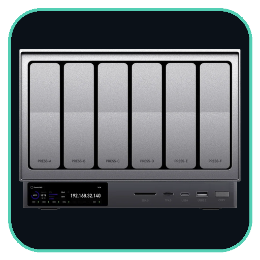
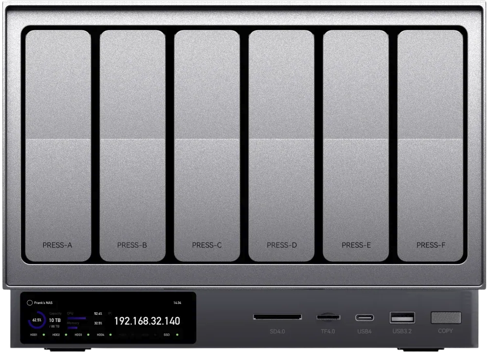

<div align="center">
  
  <h1>ZettNAS Toolkit</h1>
  <p><strong>All-in-one chassis management suite and live front-panel LCD dashboard for Zettlab NAS enclosures (D4, D6, D8).</strong></p>

  <p>
    <a href="https://github.com/fr0styx/zettnas-toolkit/releases"></a>
    <a href="LICENSE"></a>
    
    
  </p>
</div>

---

## Overview

**ZettNAS Toolkit** is a comprehensive hardware management suite engineered specifically for Zettlab NAS chassis (D4, D6, and D8 models) running Unraid or Debian/Docker environments.

It delivers **zero-overhead, direct-to-framebuffer rendering** for the 640×172 front-panel IPS display, **intelligent dual-zone thermal fan curve regulation**, **dynamic ARGB LED lightbar effects** with error-reactive lighting, and a **real-time web studio** with drag-and-drop live canvas arrangement.

<div align="center">
  
</div>

---

## Key Features

### 🖥️ Direct Framebuffer LCD Dashboard (`/dev/fb0`)
* **Zero-Overhead Active Rendering**: Renders natively at 640×172 using hardware-accelerated CSS orientation transforms (`rotate(90deg) translate(0, -172px)`) and single-pass memory-mapped (`mmap`) framebuffer streaming to `/dev/fb0` without CPU matrix rotation overhead.
* **Bezel-Safe Geometry**: Balanced 12px bezel margins and optimized typography to prevent edge occlusion or pixel loss on physical front-panel bezels.
* **Real-Time Telemetry**: Storage pool capacity donut, CPU utilization arc, core thermals, RAM gauge, dual network throughput (TX/RX), active fan tachometers, and per-drive status.
* **Drive Standby Awareness**: Detects spun-down drives (`standby`) with sleep preservation and visual `zZz` indicators—never unnecessarily wakes sleeping disks.

### 🎛️ Interactive Web Studio & Live Canvas Re-arrange (Port `8082`)
* **LCD Live Canvas Re-arrange & Preview**: Drag-and-drop module reordering in the toolkit drawer with bidirectional adjacent swapping, container gap-snapping, and persistent layout saving (`/tmp/dash_layout.json`).
* **S.M.A.R.T. Health Inspector**: Click any disk card to view full S.M.A.R.T. diagnostic attributes, model numbers, power-on hours, and raw telemetry in an interactive modal.
* **Module Customization**: Toggle visibility of individual metric cards or disk rows, switch between Full and Compact card sizes, and choose 12-hour or 24-hour clock formats.
* **Chassis Workbench**: Front-panel simulator with scalable chassis zoom (1x, 1.25x, 1.5x, 2x) and interactive LED lighting preview.
* **Mobile-Responsive Design**: Full `@media` query layout adaptation for monitoring the dashboard from smartphones and tablets on the go, complete with a built-in Light/Dark mode toggle.
* **Persistent State Management**: Fan configs, LED lighting preferences, and dashboard layouts are now saved safely to the `/app/data/` volume and survive container reboots.
* **Real-Time SSE Engine**: Fast Server-Sent Events (`/api/stats/stream`) push architecture delivers ultra-low latency telemetry updates to the browser.
* **LCD Health & FPS Badge**: Live studio badge tracking the headless Chromium renderer's health, actual rendering FPS, and `/dev/fb0` framebuffer status.


### 💾 Hardware Media Ingestion Engine
* **Physical Front-Panel "Copy" Binding**: Mount and ingest contents from inserted SD or TF cards directly to your array at the push of a button.
* **Zero-Latency Telemetry**: Instant 0ms UI reactions to physical button presses, completely eliminating polling delays via Server-Sent Events.
* **File Collision Intelligence**: Pre-scans for duplicates before transferring, invoking an inline WebUI dialog to Skip, Overwrite, or safely Cancel the ingest.
* **Kernel-Level I/O Tuning**: Unlocks maximum USB 4.0 read bandwidth (~1000+ MB/s routing throughput) by actively dropping `noatime,nodiratime` kernel flags on media mounts.
* **Secure Abort Protocol**: Instantly kill active ingestion threads from the web dashboard while automatically purging partially-written media to prevent corruption.

### ❄️ Intelligent Thermal Fan Automation
* **Dual-Zone Drive Cooling**: Automatic SATA backplane fan regulation mapped directly to drive temperatures.
* **Interactive SVG Fan Curve Workstation**: Complete visual thermal curve editor with 4 draggable inflection points for precise, multi-stage PWM ramp-up tuning.
* **Manual PWM Override**: Direct hardware duty-cycle command (`0–183` / 0–100%) for diagnostic testing and airflow verification.
* **Active Rotor Animations**: Browser and LCD fan icons spin dynamically at rates proportional to real-time tachometer RPM.

### 💡 Chassis ARGB Lightbar Control (`/dev/ttyACM0`)
* **Serial Protocol Integration**: Direct communication with the onboard microcontroller using CRC-validated packets.
* **Lighting Modes**: Solid, Breathe, Flow, Chase, Gradient, Flashing, and real-time Rainbow.
* **Error-Reactive Safeguards**: Automatically overrides lighting with an amber warning breathe or pulsing red alert if a drive reports S.M.A.R.T. degradation, CPU breaches 70°C/85°C, or a fan stalls.
* **Disk IO "Cylon" Effect**: Active drive read/write operations can visually translate to a scanning Cylon animation on the front LEDs.
* **Accurate Night Dimming**: Timezone-aware logic guarantees the LCD display and LEDs dim reliably during your configured night hours.

---


## Hardware Compatibility

| Component | Target Hardware | Notes |
| :--- | :--- | :--- |
| **Enclosures** | Zettlab D4, D6, D8 | Auto-detected via DMI product name or discovered drive topology |
| **Display** | Internal 640×172 IPS LCD | Interfaced directly via `/dev/fb0` (stride 704) |
| **Fan Controller** | Motherboard `hwmon` | Supports `nct6775`, `it87`, `zettlab_d8_fans`, or standard Linux PWM (`pwm1`–`pwm3`) |
| **ARGB Strip** | Built-in USB microcontroller | Recognized as `ZettOS_RGB` or `/dev/ttyACM0` (38 WS2812B nodes) |

---

## Installation & Deployment

### Option A: Unraid Docker Template (Recommended for Unraid)

1. On your Unraid server, place [`unraid/zettnas-toolkit.xml`](unraid/zettnas-toolkit.xml) into:
   ```bash
   /boot/config/plugins/dockerMan/templates-user/my-zettnas-toolkit.xml
   ```
2. Navigate to the **Docker** tab in the Unraid web interface.
3. Click **Add Container**, select **zettnas-toolkit** from the template dropdown, verify device paths (`/dev/fb0`, `/dev/dri`), and click **Apply**.
4. The container will automatically appear with the official icon, WebUI button, and full Unraid management features.

---

### Option B: Docker Compose

1. **Verify Prerequisites**:
   Ensure `/dev/fb0` and `/dev/ttyACM0` exist on your host:
   ```bash
   ls -l /dev/fb0 /dev/ttyACM0
   ```

2. **Clone the Repository**:
   ```bash
   cd /mnt/user/appdata
   git clone https://github.com/fr0styx/zettnas-toolkit.git
   cd zettnas-toolkit
   ```

3. **Configure Environment**:
   ```bash
   cp .env.example .env
   ```
   Edit `.env` to match your server configuration:
   ```ini
   NAS_NAME=Ark
   PORT=8082
   STORAGE_POOL_PATH=/mnt/user
   OS_NVME=nvme1n1
   LCD_FPS=10
   LCD_FORMAT=png
   ```

4. **Launch the Container**:
   ```bash
   docker compose up -d --build
   ```

---


---

## Development & Build Process

The frontend architecture relies on a modern ES6 module structure and is bundled via Vite. To modify the frontend:

1. Edit the source files located in `frontend/src/` (e.g. `main.js`, `style.css`, `modals.js`).
2. Run the Vite build command to bundle, minify, and hash the outputs:
   ```bash
   cd frontend
   npm install
   npm run build
   ```
3. The build artifacts will automatically be written to the `static/` directory and served by the Python backend.

*(Note: Do not manually edit the files inside the `static/` directory as they are generated build artifacts and will be overwritten.)*

## Keyboard Shortcuts & Easter Eggs

When accessing the Web Studio (`http://<server-ip>:8082`):
* `T` — Toggle the Hardware Toolkit Settings Drawer.
* `Z` or `Mouse Wheel` — Cycle Chassis Zoom scale (1x, 1.25x, 1.5x, 2x).
* `Y` — *Trust in the Yak* (Theme & Easter Egg).
* `Esc` — Close open modals and drawers.

---

## REST API Endpoints

| Endpoint | Method | Description |
| :--- | :--- | :--- |
| `/api/stats` | `GET` | Complete real-time system metrics (CPU, memory, storage, fans, disks, lightbar, layout version) |
| `/api/layout` | `GET` / `POST` | Retrieve or persist dashboard layout, card ordering, visibility, and clock settings |
| `/api/fans` | `GET` / `POST` | Inspect tachometer RPMs and set fan presets or manual PWM duty cycles |
| `/api/leds` | `GET` / `POST` | Query current lightbar status or command modes, colors, brightness, and speeds |
| `/api/screen/brightness` | `POST` | Dynamically adjust front-panel LCD backlight brightness (0–100%) |

---

## Acknowledgments & Community Credits

This project builds upon the foundational reverse-engineering and hardware discoveries established by the community:

* **[torharrington/zettlab-display](https://github.com/torharrington/zettlab-display)** — Early framebuffer display proof-of-concepts, layout experiments, and initialization routines for Zettlab front-panel LCD screens.
* **[henryxwong/zettlab-ubuntu](https://github.com/henryxwong/zettlab-ubuntu)** — Detailed documentation on Zettlab hardware interfaces, fan controller registers (`hwmon`), LED serial packet structures, and Linux kernel integration.

---

## License

This project is licensed under the [MIT License](LICENSE).
